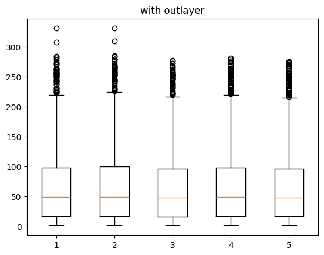
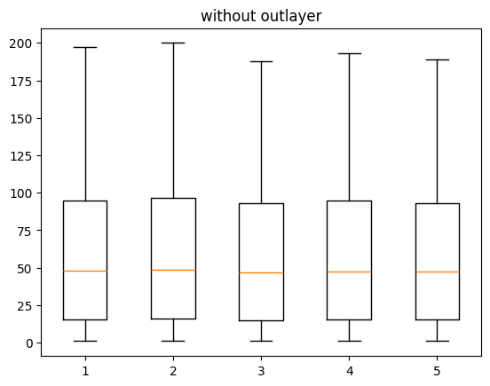
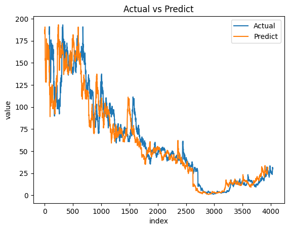

# Pridicting RPower Prices

### Before outliers

### After outliers

### Result:

**accuracy_score: 0.9999645553285698**

**Mean Squared Error: 0.09371009554476636**

**Mean Absolute Error: 0.23798272989515687**

**Mean Square Root Error: 0.3061210472097049**

### Output
